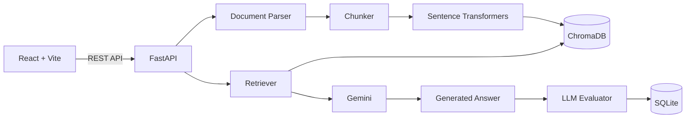

# RAG Answer Eval

A full-stack Retrieval-Augmented Generation (RAG) application that answers questions from your own documents and automatically evaluates answer quality.

## Core flow

Document upload → text extraction → chunking → embeddings → ChromaDB retrieval → Gemini answer generation → automated evaluation → SQLite run history

## Features

- Real document upload and indexing
- PDF, TXT and Markdown extraction
- Configurable chunk size and overlap
- Sentence-Transformers embeddings
- ChromaDB cosine-similarity retrieval
- Configurable top-k and similarity threshold
- Grounded Gemini answer generation
- LLM-based evaluation
- Answer Relevance
- Faithfulness / Groundedness
- Context Precision
- Completeness
- Overall Score
- Evaluation reasoning and issue detection
- Dynamic dashboard KPIs
- Persistent evaluation history
- Document deletion with vector cleanup
- Loading, error and empty states
- Responsive black-and-white UI

## Architecture



## Tech stack

Frontend: React, Vite, Lucide React  
Backend: Python, FastAPI  
LLM: Google Gemini API  
Embeddings: Sentence-Transformers (all-MiniLM-L6-v2)  
Vector database: ChromaDB  
Metadata/history: SQLite  
Documents: pypdf

## Evaluation metrics

| Metric | What it measures |
|---|---|
| Answer Relevance | Whether the answer directly addresses the question |
| Faithfulness | Whether answer claims are supported by retrieved context |
| Context Precision | Whether retrieved passages are relevant |
| Completeness | Whether important context-supported information is covered |
| Overall Score | Balanced answer quality |

All scores are generated at runtime by the evaluator; the dashboard does not use hardcoded evaluation scores.

## Local setup

### 1. Backend setup

The backend is a Python/FastAPI application, but it exposes a simple `npm run dev` command for a consistent developer workflow.

From the repository root, create the virtual environment once:

```powershell
python -m venv .venv
.\.venv\Scripts\Activate.ps1
```

Then open Terminal 1:

```powershell
cd backend
pip install -r requirements.txt
npm run dev
```

The backend starts at:

- API: http://localhost:8000
- Health: http://localhost:8000/api/health

The `backend/package.json` only provides the `npm run dev` shortcut; the backend itself is Python/FastAPI.

### 2. Frontend setup

Open Terminal 2:

```powershell
cd frontend
npm install
npm run dev
```

The frontend starts at:

- http://localhost:5173

### 3. Environment

Create the root `.env` from `.env.example` and add your Gemini API key:

```env
GEMINI_API_KEY=your_gemini_api_key
GEMINI_MODEL=gemini-2.5-flash
```

The first backend startup downloads the Sentence-Transformers embedding model.

## Standard development workflow

After the initial setup, always use two terminals.

**Terminal 1 — Backend**
```powershell
cd backend
npm run dev
```

**Terminal 2 — Frontend**
```powershell
cd frontend
npm run dev
```

The backend's `npm run dev` is only a shortcut for starting Uvicorn; the backend remains Python/FastAPI.

### Environment file locations

There is intentionally **one backend environment file**:

```text
RAG-Answer-Eval/
├── .env                 # real backend secrets/config; never commit
├── .env.example         # backend config template
├── frontend/
│   └── .env.example     # frontend Vite config template
└── backend/
    └── data/            # runtime ChromaDB + SQLite; generated locally
```

Do not create another `backend/.env`. The backend loads the root `.env`. The frontend only needs a local `frontend/.env.local` if you want to override `VITE_API_URL`.

## How the RAG pipeline works

1. User uploads a PDF, TXT or Markdown document.
2. FastAPI extracts text and keeps page metadata for PDFs.
3. Text is cleaned and split into overlapping chunks.
4. Sentence-Transformers converts chunks into normalized embeddings.
5. Chunks and metadata are stored in ChromaDB.
6. A user question is embedded with the same model.
7. ChromaDB returns the most similar chunks using cosine distance.
8. Gemini receives the question plus retrieved context and is instructed not to invent information.
9. A second Gemini call evaluates the generated answer against the question and retrieved context.
10. The result and metrics are persisted in SQLite.

## API endpoints

- POST /api/documents/upload
- GET /api/documents
- DELETE /api/documents/{id}
- POST /api/rag/query
- GET /api/evaluations
- GET /api/evaluations/{id}
- GET /api/stats
- GET /api/health

## Environment variables

See `.env.example`.

Important variables:

- GEMINI_API_KEY
- GEMINI_MODEL
- EMBEDDING_MODEL
- VECTOR_DB_PATH
- SQLITE_PATH
- CHUNK_SIZE
- CHUNK_OVERLAP
- TOP_K
- SIMILARITY_THRESHOLD
- MAX_UPLOAD_MB
- VITE_API_URL

Never commit `.env`, `backend/data`, uploaded files or virtual environments.

## Project structure

```text
RAG-Answer-Eval/
├── frontend/
│   ├── src/
│   │   ├── main.jsx
│   │   └── styles.css
│   ├── index.html
│   ├── package.json
│   └── vite.config.js
├── backend/
│   ├── app/
│   │   ├── routes/
│   │   └── services/
│   ├── tests/
│   ├── package.json
│   └── requirements.txt
├── .env
├── .env.example
├── .gitignore
├── frontend/
│   ├── .env.example
│   ├── src/
│   ├── index.html
│   ├── package.json
│   └── vite.config.js
├── backend/
│   ├── app/
│   ├── tests/
│   ├── package.json
│   └── requirements.txt
└── README.md
```

The root `package.json` is optional convenience tooling. Normal development uses the separate `frontend` and `backend` directories.

## Testing

Run backend tests from the repository root:

```bash
pytest backend/tests
```

The tests cover chunking and API health. The live RAG path additionally requires a Gemini API key and local embedding/vector dependencies.

## Interview-ready explanation

RAG Answer Eval is an end-to-end RAG system with an evaluation layer. Instead of asking an LLM to answer from memory, the system first retrieves semantically similar passages from the user's documents. Those passages become the grounded context for Gemini. After generation, another evaluator checks whether the answer is relevant, faithful to the retrieved context, supported by high-quality retrieval, and complete. The application stores every run so quality can be inspected over time.

## Future improvements

- Hybrid BM25 + vector retrieval
- Cross-encoder reranking
- Streaming model responses
- Authentication and per-user knowledge bases
- Background document processing
- Benchmark datasets and regression testing
- Cloud vector database deployment
